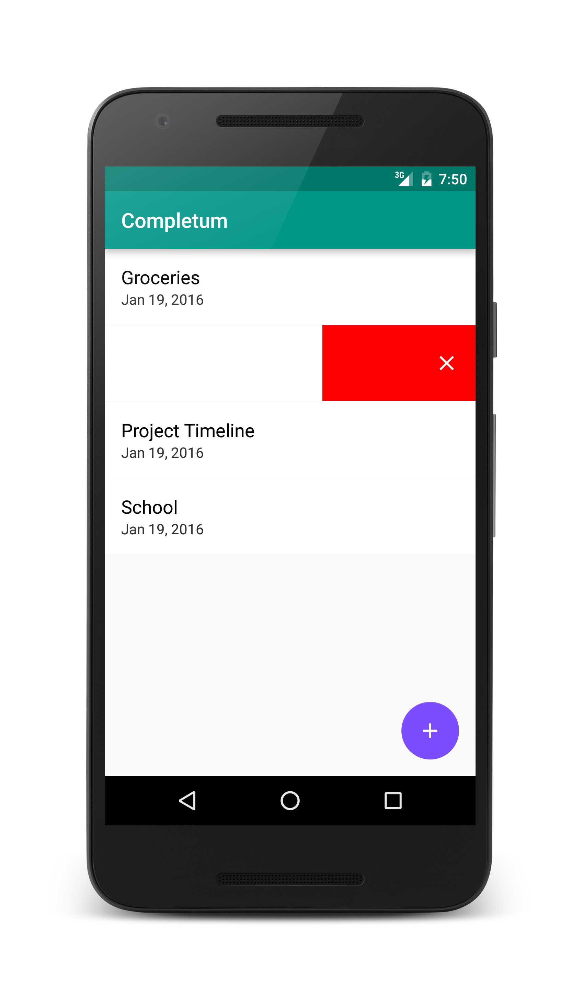

# Completum
Completum is a to-do list dedicated to minimalism and productivity. Easily create, delete, and complete tasks and to-do lists to maximize your productivity potential.
I released all of the code for this app to give guidance and assistance to individuals looking to learn Android development.

